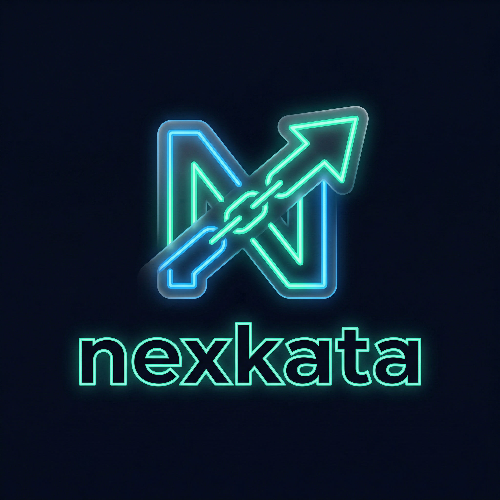

<p align="center">
  
</p>

<h1 align="center">nexkata</h1>

<p align="center">
  <strong>A real-time vocabulary helper for the Roblox Sambung Kata (Last Letter) word game</strong><br/>
  Find valid Indonesian KBBI words instantly — filtered, sorted, and strategically rated.
</p>

<p align="center">
  
  
  
  
</p>

---

## What is nexkata?

**nexkata** is a browser-based tool built for players of the Roblox game **Sambung Kata** — a competitive Indonesian word-chaining game where each word must start with the last letter of the previous one.

Type 1–4 letters and instantly get a filtered, sorted list of valid KBBI words. One click copies the word to your clipboard, ready to paste into Roblox.

---

## Features

| | Feature | Description |
|---|---|---|
| 🔍 | **Instant Search** | Real-time results as you type — no button needed |
| 📚 | **Dual KBBI Dataset** | Switch between 71k (broad) and 30k (strict) word lists |
| 🔥 | **Difficulty Ratings** | Words rated by how hard the ending letter is for your opponent |
| ❌ | **Invalid Word Blacklist** | Mark rejected words — they'll never appear again |
| 💾 | **Persistent Session** | Used words saved in localStorage across refreshes |
| 🔀 | **Smart Sorting** | Sort by length, A–Z, or hardest-ending-first |
| 📋 | **One-click Copy** | Click any word to instantly copy it to clipboard |
| 📊 | **Session Statistics** | Track words used, hard picks, and your longest word |
| 📱 | **Mobile-first** | Fully responsive — designed for phone use mid-game |

---

## Dataset Switch

Click the **📚 dataset button** in the header to switch between two KBBI sources at any time. Your preference is saved locally.

| Dataset | Words | Source |
|---|---|---|
| **Damzaky** *(default)* | 71,278 | [damzaky/kumpulan-kata-bahasa-indonesia-KBBI](https://github.com/damzaky/kumpulan-kata-bahasa-indonesia-KBBI) |
| **KBBI Resmi** | 30,452 | [nandalogina/kbbi-database](https://github.com/nandalogina/kbbi-database) |

---

## Difficulty System

Every word card shows how hard its ending letter is for your opponent to counter:

| Rating | Ending Letters | Difficulty |
|---|---|---|
| *(none)* | a b d i j k l m n p r s t u | Normal |
| 🔥 | c g h o w y | Hard |
| 🔥🔥 | e f v x | Very Hard |
| 🔥🔥🔥 | q z | Extreme — almost unbeatable |

> **Strategy tip:** Words ending in `q` or `z` are nearly impossible to counter in standard Indonesian. Play them to end a round.

---

## How to Use

1. Note the **last letter** of your opponent's word
2. Type it into the search box
3. Sort by **🔥🔥🔥 Hardest** for the most strategic pick
4. Click a word → it's **copied to clipboard** and marked as used
5. Paste it directly into Roblox chat

---

## Tech Stack

Zero dependencies. No build step. Pure browser.

```
nexkata/
├── index.html          # App shell & dynamic script loader
├── style.css           # Dark glassmorphism UI
├── app.js              # Game logic, dataset switch, statistics
├── words-kbbi1.js      # Damzaky dataset — 71,278 words
├── words-kbbi2.js      # KBBI Resmi dataset — 30,452 words
├── build-words.js      # CLI: regenerate words-kbbi1.js
├── build-kbbi2.js      # CLI: regenerate words-kbbi2.js
├── nexkata-logo.png    # App logo (favicon + header)
└── netlify.toml        # Deployment config
```

---

## Local Development

```bash
git clone https://github.com/zerydery/last-letter.git
cd last-letter

# Open directly in browser (no server needed)
start index.html        # Windows
open index.html         # macOS / Linux
```

To rebuild a word dataset:

```bash
node build-words.js     # rebuild words-kbbi1.js from words.txt
node build-kbbi2.js     # rebuild words-kbbi2.js from kbbi_kata.txt
```

---

## Deployment

Static site — works anywhere:

- **Netlify** (recommended): Connect GitHub → branch `main` → publish dir `/`
- **GitHub Pages**: Enable Pages on `main` branch
- **Netlify Drop**: Drag the project folder to [app.netlify.com/drop](https://app.netlify.com/drop)

---

## License

[MIT](LICENSE) © zerydery
